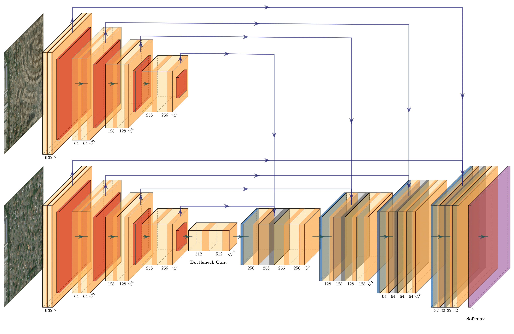

# Image Segmentation Model for the [xView2](https://xview2.org/) Competition

## Dual-Image Input U-Net Model Used:

## Environment Setup:
- The code in this repository was run in a Python 3.7 environment.
- Project requirements are located in the `requirements.txt` file

## Instructions:
**Download the data from:**
- https://xview2.org/dataset

**Run transform_data.sh** 
- To consolidate the training and tier 3 data and the testing and holdout data into train and test directories, respectively

**Run data_preprocessing.py**
- Reads the json label data and creates a ‘targets’ directory containing the pre- and post-disaster image masks

**Run train_model.py**
- This script imports keras_dataset.py and dual_image_unet.py to use during training.
- LabeledImageDataset takes in the pre and post images along with the post labels - make sure the pattern variable is in the right directory
- U-Net is the dual image input U-Net - make sure the number of output classes is correct (should be 5, for the different levels of damage)
- Best model weights will be saved based on the validation loss. Saved to an hdf5 file.

**Run test_process.py**
- This script formats the test targets directory from earlier in a way that each target label is of shape (1024, 1024) and each pixel has the class label.
- It also loads in the pretrained model weights and predicts on the test images.
- These predictions are output in the same shape and format as the target labels - into the predictions directory.

**Run the final metrics calculator at:**
- https://github.com/DIUx-xView/xView2_scoring/blob/master/xview2_metrics.py
	
**Plotting_sample_images.py**
- Contains functions needed to plot the masks over the original image. This assists in visualizing the results.
